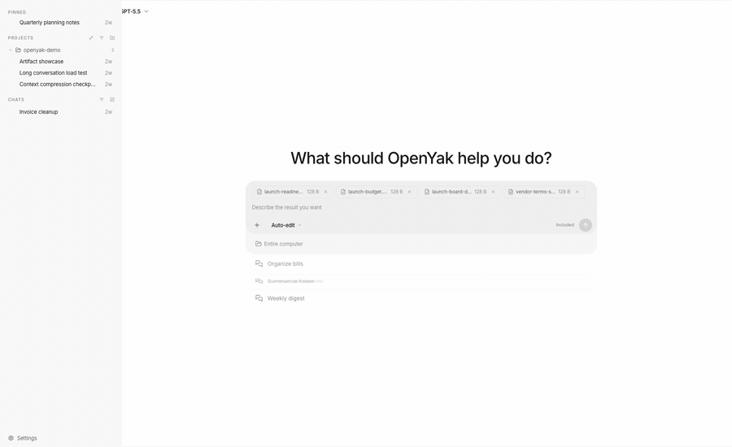
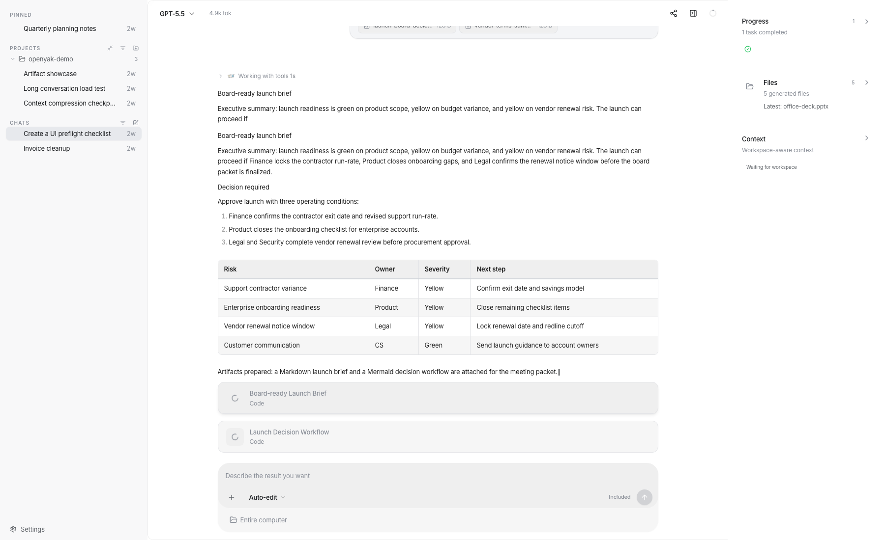
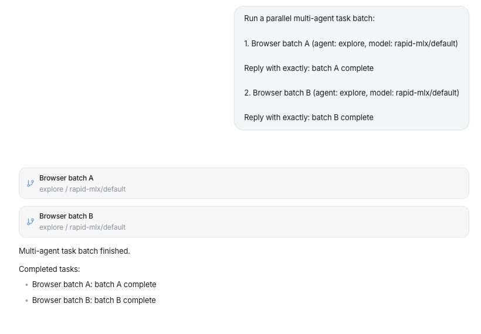
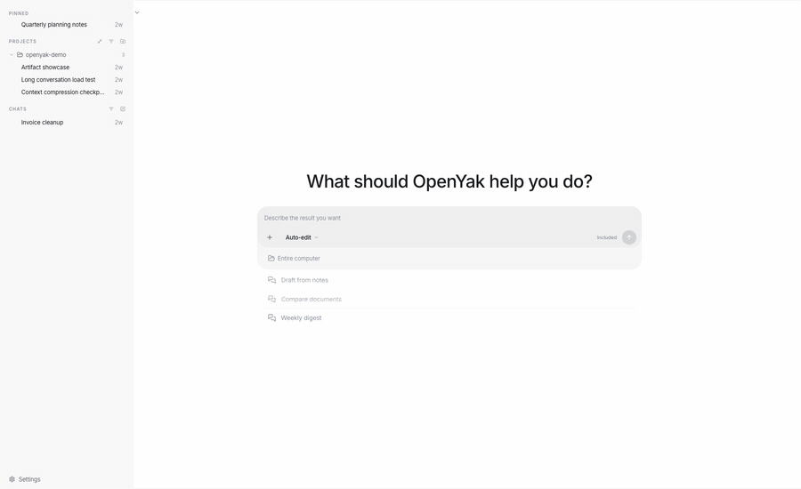

# fpi-agent

<p align="center">
  <a href="README.zh-CN.md"></a>
  <a href="https://github.com/meliwanx/fpi-desk-agent/actions/workflows/ci.yml"></a>
  <a href="https://github.com/meliwanx/fpi-desk-agent/stargazers"></a>
  <a href="https://github.com/meliwanx/fpi-desk-agent/blob/main/LICENSE"></a>
  <a href="https://github.com/meliwanx/fpi-desk-agent/releases/latest"></a>
  
  <a href="https://github.com/meliwanx/fpi-desk-agent/pulls"></a>
</p>

<p align="center">
  
</p>

<h3 align="center">A local-first AI agent for files, tools, long threads, and real desktop work.</h3>

<p align="center">
  Run an agent on your own computer, work with local files, use local models when you can, and choose cloud providers only when you want them.
</p>

---

## Why fpi-agent

fpi-agent is built for people who want an AI agent that lives on their machine instead of behind another hosted workspace account.

- **No fpi-agent account.** Install the app, choose a local model or bring your own provider key, and start working without login, billing, seats, or recharge flows.
- **Local-first agent runtime.** Files, conversations, memory, generated artifacts, tool permissions, and workflow state stay on your device.
- **Work from your actual files.** Attach DOCX, XLSX, PPTX, PDFs, CSVs, and local project context, then ask for briefs, tables, follow-ups, plans, and reusable artifacts.
- **Keep the workflow in one thread.** Start with analysis, continue into a RACI, ask for a follow-up email, and preserve context across long conversations.
- **Choose your model boundary.** Run local models through [Rapid-MLX](https://github.com/raullenchai/Rapid-MLX) or [Ollama](https://ollama.com), or opt into direct BYOK calls to OpenRouter, OpenAI, Anthropic, Google, and other providers.
- **Use your desktop agent from another device.** Remote access lets you scan a QR code and send tasks to your computer through a secure tunnel.

## What It Feels Like

| Ask fpi-agent to... | It should give you... |
|-------------------|------------------------|
| Read a long memo | Executive brief, risks, owners, next actions, and a send-ready email |
| Analyze a workbook | Budget vs. actual variance, drivers, anomalies, and finance talking points |
| Review a deck | Slide-by-slide story, evidence gaps, speaker notes, and decision ask |
| Synthesize several files | One board brief that reconciles memo, budget, deck, and PDF context |
| Split work across agents | Parallel child-agent tasks with links back to each focused session |
| Continue the same thread | RACI, 30-day plan, agenda, and follow-up drafts without restating context |
| Recover from an error | Clear next step when upload, auth, or file parsing fails |

## Office Workflows

### From Memo to Executive Brief

fpi-agent can turn a dense memo into a structured brief that is ready for a manager, team update, or follow-up email.

<p align="center">
  
</p>

<p align="center">
  
</p>

### From Spreadsheet to Finance View

Use spreadsheets as working inputs, not screenshots. Ask for budget variance, forecast risks, owner-level action items, and meeting-ready talking points.

<p align="center">
  
</p>

### From Multiple Files to an Artifact

fpi-agent can synthesize several files in the same thread and open a right-side artifact panel for reusable briefs, plans, diagrams, and structured outputs.

<p align="center">
  
</p>

### Multi-Agent Task Batches

Split a larger request into focused child-agent tasks, run them in parallel, and keep the parent thread as the place where progress, links, and the final aggregate result come back together.

<p align="center">
  
</p>

### Long Threads and Auto-Compress

Real office work rarely fits in one message. fpi-agent is designed for follow-ups, revisions, and long conversations where the important context needs to remain available.

<p align="center">
  
</p>

<p align="center">
  
</p>

## Download

| Platform | Architecture | Formats |
|----------|--------------|---------|
| macOS | Apple Silicon / Intel | `.dmg`, `.app` |
| Windows | x64 | `.exe` installer |
| Linux | x64 | `.deb`, `.rpm` |

> [Download the latest release](https://github.com/meliwanx/fpi-desk-agent/releases/latest) or visit [GitHub Releases](https://github.com/meliwanx/fpi-desk-agent/releases).
>
> Linux users can also read [LINUX.md](LINUX.md) for requirements and troubleshooting.

## Get Started

1. **Install fpi-agent** for your platform.
2. **Choose where inference runs:** local Rapid-MLX/Ollama for offline work, or a BYOK cloud provider when you want hosted models.
3. **Start a new conversation** and attach a real file.
4. **Ask for a deliverable**, not just a summary: brief, action plan, RACI, email, table, or artifact.
5. **Review the result** in the chat and artifact panel, then continue in the same thread.

Example prompt:

```text
Please read the files I uploaded and turn them into a concise team brief.
Start with three key takeaways, then list risks, owners, and next actions.
Finally, write a follow-up email I can send to the team directly.
```

## Model Options

### Local First

- **Rapid-MLX:** Apple Silicon macOS users can start and switch curated MLX models from Settings. fpi-agent connects to Rapid-MLX's OpenAI-compatible API on `localhost`.
- **Ollama:** Run any model available through [Ollama](https://ollama.com). Local models are auto-detected and can be used without an internet connection.
- **Custom local endpoints:** Point fpi-agent at a local OpenAI-compatible server when you run your own model stack.

### Optional Cloud Providers

| Provider | Access | Notes |
|----------|--------|-------|
| OpenRouter | BYOK | Bring your own OpenRouter API key |
| OpenAI | BYOK | Bring your own API key |
| Anthropic | BYOK | Bring your own API key |
| Google | BYOK | Gemini models |
| DeepSeek | BYOK | Direct provider key |
| Groq | BYOK | Fast hosted inference |
| Mistral | BYOK | Direct provider key |
| xAI | BYOK | Grok models |
| Qwen | BYOK | Direct provider key |
| Kimi | BYOK | Moonshot models |
| MiniMax | BYOK | Direct provider key |
| Zhipu | BYOK | Direct provider key |
| ChatGPT | Subscription | Use an existing ChatGPT Plus, Pro, Team, or Enterprise plan when available |

Cloud and subscription paths are optional. fpi-agent does not provide hosted model accounts and does not proxy model traffic; requests go directly from your desktop to the provider you configure.

## Core Capabilities

- **File understanding:** office docs, spreadsheets, slide decks, PDFs, CSVs, local folders, and generated artifacts.
- **Artifact workspace:** reusable Markdown briefs, tables, diagrams, checklists, and structured outputs.
- **Tool execution:** read, write, rename, organize, and automate files with user-controlled permissions.
- **Long-context work:** continue from analysis to planning to follow-up without starting over.
- **Remote access:** connect from mobile through QR code and Cloudflare Tunnel.
- **Automations:** schedule recurring cleanup, reporting, and file workflows.
- **Privacy controls:** local storage, no fpi-agent account, BYOK provider access, and local model support.

## For Developers

**Tech Stack:** Tauri v2, Rust, Next.js 15, FastAPI, SQLite

**Monorepo Structure:**

```text
desktop-tauri/    Rust desktop shell and system integration
frontend/         Next.js chat UI, settings, artifacts, and SSE streaming
backend/          FastAPI agent engine, tool execution, LLM streaming, storage
```

**Quick Start:**

```bash
npm run dev:all
```

This starts the backend on port `8000` and the frontend on port `3000`. For deeper setup notes, see [frontend/README.md](frontend/README.md) and [backend/README.md](backend/README.md).

## FAQ

<details>
<summary>Does my data leave my machine?</summary>

Files, conversations, memory, generated artifacts, and workflow state are stored locally. If you use Rapid-MLX, Ollama, or another local endpoint, model requests stay on your machine. If you choose a cloud model, the prompt and relevant context are sent directly from your desktop to the model provider you selected.
</details>

<details>
<summary>Do I need an fpi-agent account?</summary>

No. fpi-agent does not require an fpi-agent account, login, billing profile, recharge flow, team workspace, or hosted fpi-agent backend. Cloud providers, when used, require your own API key or existing subscription.
</details>

<details>
<summary>How is fpi-agent different from ChatGPT or Claude.ai?</summary>

fpi-agent runs on your desktop and is designed around local files, artifacts, tools, permissions, and workflow continuity. Web chat products are great assistants; fpi-agent is closer to a local agent workbench that can inspect files, use tools, and keep long-running work tied to your machine.
</details>

<details>
<summary>Can I use it offline?</summary>

Yes. On Apple Silicon macOS, use Rapid-MLX with a downloaded MLX model. On macOS, Windows, or Linux, install Ollama and download a model. fpi-agent can then run without cloud model calls.
</details>

<details>
<summary>How does remote access work?</summary>

Enable remote access in settings, scan the QR code, and open the mobile web client. fpi-agent connects through Cloudflare Tunnel with token-based authentication, so you do not need port forwarding.
</details>

## Community

- **Questions and Discussions:** [GitHub Discussions](https://github.com/meliwanx/fpi-desk-agent/discussions)
- **Bug Reports:** [GitHub Issues](https://github.com/meliwanx/fpi-desk-agent/issues)
- **Contributing:** [CONTRIBUTING.md](CONTRIBUTING.md)

## License

[Apache-2.0](LICENSE)
