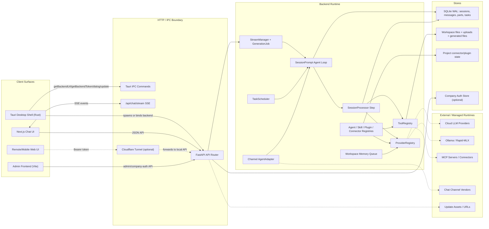
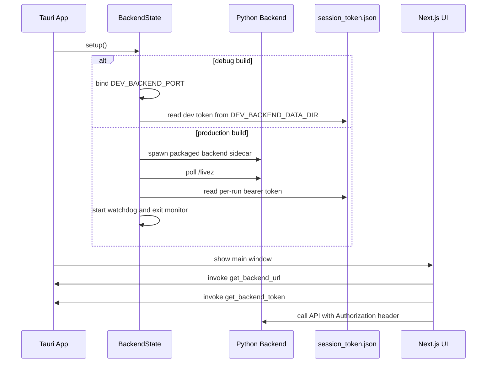
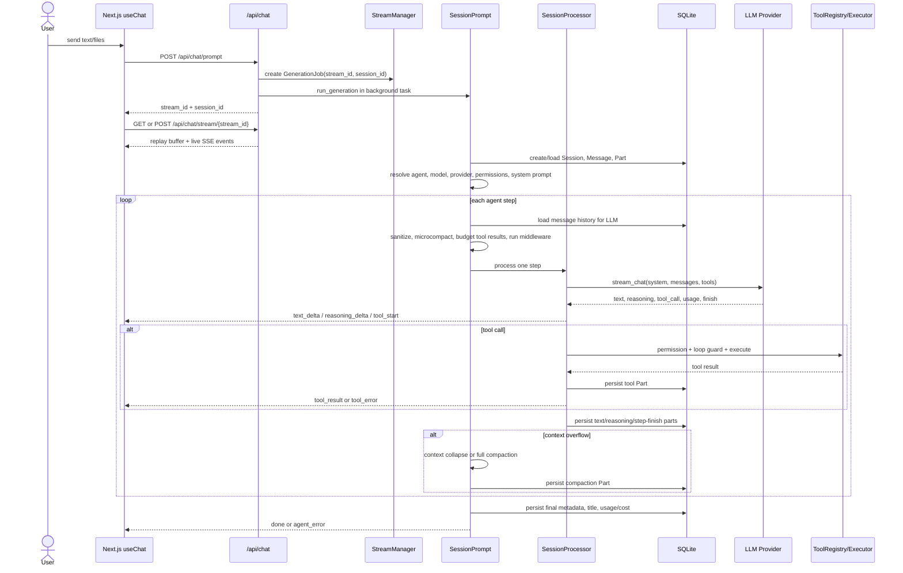
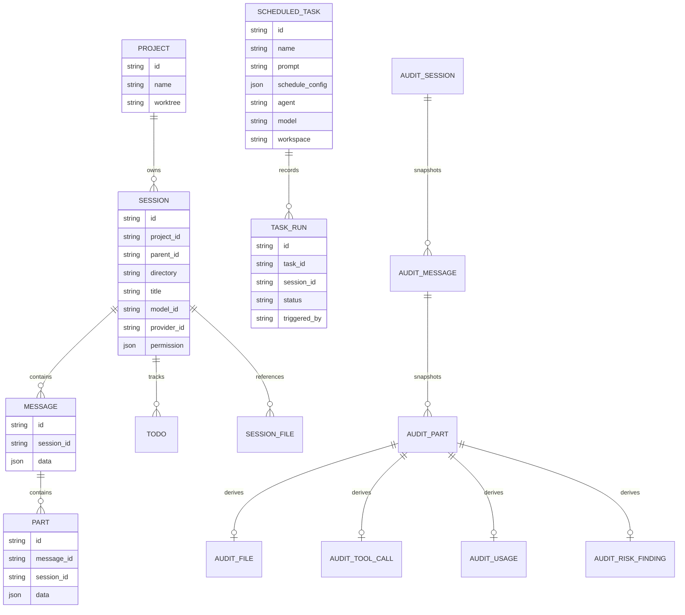
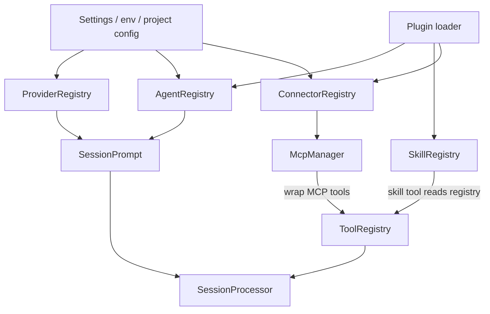

# fpi-agent 架构说明

本文基于当前仓库代码梳理，目标是让新加入的开发同事快速理解系统边界、主要运行时组件、对话生成链路和数据模型。

## 一句话概览

fpi-agent 是一个 local-first 桌面 AI Agent 工作台：Tauri 负责桌面壳和系统集成，Next.js 负责用户界面，FastAPI 后端承载 Agent 循环、工具执行、模型 Provider、插件/MCP 连接、本地存储、远程访问和自动化任务。

## 代码入口

| 区域 | 入口 | 职责 |
| --- | --- | --- |
| 桌面壳 | `desktop-tauri/src-tauri/src/lib.rs` | 注册 Tauri 插件、菜单、托盘、IPC 命令，启动或绑定 Python 后端 |
| 后端启动 | `backend/run.py` | 桌面生产模式下的 PyInstaller 后端入口，设置 data/resource dir 后运行 Uvicorn |
| FastAPI app | `backend/app/main.py` | 创建 app、注册中间件/路由、lifespan 初始化所有后端服务 |
| 前端入口 | `frontend/src/app/page.tsx` | Next.js 主 UI |
| 前端 API 层 | `frontend/src/lib/api.ts`、`frontend/src/lib/constants.ts` | 解析本地/远程后端地址，注入认证头，定义 API path |
| 聊天 Hook | `frontend/src/hooks/use-chat.ts` | 发起 prompt/task batch，接入 SSE 流 |
| 管理后台 | `admin-frontend/src/App.tsx` | 企业管理台：用户、审计、反馈、模型策略、更新包 |

## 运行时组件图

## 桌面启动链路

关键点：

- Tauri 不承载 Agent 逻辑，只做桌面壳、IPC、托盘、菜单、更新、系统文件保存等系统能力。
- 生产桌面版启动 PyInstaller 打包的后端 sidecar，开发版默认绑定外部已启动的 backend。
- 后端每次启动写入一个本地 `session_token.json`，前端通过 Tauri IPC 获取 token 后对 API 加 `Authorization: Bearer ...`。
- `BackendState` 有 watchdog 和 exit monitor；后端崩溃后会重启并通过 `backend-restart` 事件通知前端刷新 URL/token。

相关代码：

- `desktop-tauri/src-tauri/src/backend.rs`
- `desktop-tauri/src-tauri/src/commands.rs`
- `frontend/src/lib/tauri-api.ts`
- `frontend/src/lib/constants.ts`
- `backend/run.py`

## 后端初始化顺序

`backend/app/main.py` 的 FastAPI lifespan 是后端运行时装配中心，主要顺序如下：

1. 创建 per-run session token，设置 CORS、PNA、CSRF、Bearer auth、company auth 中间件。
2. 创建 SQLAlchemy async engine 和 session factory，默认 SQLite WAL，也支持其他 SQL 数据库。
3. 初始化可选的 company auth store，用于企业用户、模型策略、更新策略、反馈等。
4. 初始化 `ProviderRegistry`，注册 OpenAI subscription、Ollama、Rapid-MLX、BYOK providers、自定义 endpoint、company-managed model policy。
5. 初始化 `AgentRegistry`、`SkillRegistry`、`PluginManager`、`ConnectorRegistry`。
6. 初始化 `ToolRegistry`，注册内置工具，再把已连接 MCP server 的工具包装后注册进去。
7. 启动 FTS、自动化调度器、渠道系统、远程隧道、workspace memory queue。
8. shutdown 时中止活跃生成任务，停止渠道、隧道、连接器、调度器、FTS、本地模型进程并释放数据库连接。

## 一次对话生成链路

关键点：

- `/api/chat/prompt` 只创建 job 并启动后台任务；真正增量结果通过 `/api/chat/stream/{stream_id}` SSE 传给前端。
- `GenerationJob` 有事件 replay buffer，前端重连时使用 `Last-Event-ID` 或 query param 恢复未接收事件。
- `SessionPrompt` 是外层 agent while-loop，负责 setup、历史消息、上下文压缩、继续/停止策略。
- `SessionProcessor` 是单步处理器，负责一次 LLM stream、工具调用、权限检查、loop detection、持久化 step parts。
- 工具执行结果和模型输出都会落到 `Message`/`Part`，UI 渲染和导出都读同一份结构化历史。

相关代码：

- `backend/app/api/chat.py`
- `backend/app/streaming/manager.py`
- `backend/app/session/prompt.py`
- `backend/app/session/processor.py`
- `backend/app/session/llm.py`
- `frontend/src/hooks/use-chat.ts`
- `frontend/src/lib/sse.ts`
- `frontend/src/lib/session-stream-registry.ts`

## 核心数据模型

`Message` 不是纯文本记录，`Part.data` 是核心扩展点。当前常见 part 类型包括：

- `text`：用户或助手文本。
- `file`：上传/附加文件引用。
- `reasoning`：模型 reasoning 增量。
- `tool`：工具调用输入、状态、输出、metadata。
- `step-start`、`step-finish`：一次 agent step 的开始/结束、token、cost、finish reason。
- `compaction`：上下文压缩结果。
- `subtask`：子任务会话引用。

## Agent、工具、Provider 和插件

内置 agent 位于 `backend/app/agent/agent.py`：

- `build`：默认主 Agent，拥有完整工具集，写文件/编辑/命令等按权限策略询问。
- `plan`：只读规划模式，禁用写入、编辑、bash、code execution。
- `explore`：子 Agent，用于快速搜索和探索。
- `general`：通用子 Agent。
- `compaction`、`title`、`summary`：隐藏 Agent，用于上下文压缩、标题、摘要。

内置工具在 `backend/app/main.py` 的 `_register_builtin_tools()` 注册，实际实现位于 `backend/app/tool/builtin/`。MCP 工具由 `ConnectorRegistry` 启动 `McpManager` 后用 `McpToolWrapper` 包装进同一个 `ToolRegistry`；当 MCP 工具存在时，会额外注册 `tool_search` 做延迟发现。

Provider 由 `ProviderRegistry` 管理模型索引。当前支持：

- BYOK / cloud：OpenRouter、OpenAI-compatible、自定义 endpoint、Anthropic native、Gemini native 等。
- 本地：Ollama、Rapid-MLX。
- 订阅/OAuth：OpenAI subscription provider。
- 企业策略：company auth store 可下发 company-managed model policy。

## 前端状态和流式 UI

前端是 Next.js 15 + React 19，主要分层：

- `frontend/src/lib/api.ts`：统一 `fetch` 包装，处理 desktop/remote/web 三种 URL 和认证头。
- `frontend/src/lib/constants.ts`：API path、SSE path、后端 URL/token cache。
- `frontend/src/lib/sse.ts`：SSE client，支持 EventSource、本地 token query、fetch streaming、心跳超时和重连。
- `frontend/src/lib/session-stream-registry.ts`：按 session 管理 SSE stream 生命周期。
- `frontend/src/stores/*`：Zustand store，管理 chat、artifact、activity、settings、workspace、sidebar 等 UI 状态。
- `frontend/src/hooks/*`：React Query + store 的业务 hook，例如 sessions/messages/models/plugins/connectors/usage。
- `frontend/src/components/parts/`：按 Part 类型渲染消息内容。

## 企业/admin 边界

企业能力由两部分组成：

1. `company-auth`：员工登录态、管理员用户、模型策略、更新策略、反馈、更新包资产，使用独立 `CompanyAuthStore`。
2. `audit`：员工桌面客户端同步过来的会话、消息、parts、文件、工具调用、用量、风险发现，使用 `backend/app/models/audit.py` 的集中表结构。

管理后台 `admin-frontend` 是一个 Vite SPA。打包后后端会把它挂载到 `/admin`；如果静态构建不存在，则返回内置 fallback 页面。

相关代码：

- `admin-frontend/src/App.tsx`
- `admin-frontend/src/modelPolicy.ts`
- `backend/app/api/admin.py`
- `backend/app/api/company_auth.py`
- `backend/app/company_auth/store.py`
- `backend/app/models/audit.py`

## 自动化、渠道和工作区记忆

这些都是后台能力，但最终复用同一套 agent 生成管线。

| 能力 | 主要代码 | 运行方式 |
| --- | --- | --- |
| Automations | `backend/app/scheduler/engine.py`、`backend/app/scheduler/executor.py` | 调度器轮询 `ScheduledTask`，创建 headless `GenerationJob` 并调用 `run_generation()` |
| Channels | `backend/app/channels/manager.py`、`backend/app/channels/adapter.py` | 外部聊天渠道消息进入 `MessageBus`，`AgentAdapter` 转成 PromptRequest 后调用 agent 管线 |
| Workspace Memory | `backend/app/memory/workspace_memory_queue.py`、`backend/app/memory/injection.py` | 对话结束/压缩前后异步刷新工作区记忆，下次 prompt 装配进 system prompt |
| FTS | `backend/app/fts/` | 对工作区和上传附件做 SQLite FTS5 索引，供搜索工具和 UI 使用 |

## 远程访问和安全边界

- 本地 API 默认由 Bearer token 保护；桌面前端通过 IPC 获取 token。
- CSRF 中间件在后端校验 mutating request 的 Origin；CORS 只允许 Tauri 和 loopback origin。
- 远程访问启用时，Cloudflare Tunnel 把移动端请求转发到本地后端，前端使用 remote token。
- SSE 本地优先 EventSource；远程或企业登录场景使用 fetch streaming，因为需要携带 headers 且可绕开部分代理对 GET SSE 的缓冲。
- company auth 额外使用 `X-FPI-Session`，并与本地 bearer token 中间件并存。

相关代码：

- `backend/app/auth/middleware.py`
- `backend/app/auth/csrf.py`
- `backend/app/auth/private_network.py`
- `backend/app/auth/tunnel.py`
- `frontend/src/lib/remote-connection.ts`

## 开发和构建命令

| 命令 | 作用 |
| --- | --- |
| `npm run dev:all` | 启动后端和前端开发环境 |
| `npm run dev:desktop` | 启动桌面开发环境 |
| `npm run build:frontend` | 构建 Next.js 前端静态资源 |
| `npm run build:admin` | 构建 Vite 管理后台 |
| `npm run build:backend` | 先构建 admin，再用 PyInstaller 打包后端 |
| `npm run build:desktop` | 同步桌面元信息并执行 Tauri build |
| `npm run preflight:ui` | 运行前端 Playwright preflight |

## 改代码时先看哪里

| 需求 | 优先入口 |
| --- | --- |
| 改一次聊天生成行为 | `backend/app/api/chat.py`、`backend/app/session/prompt.py`、`backend/app/session/processor.py` |
| 改模型选择或 Provider | `backend/app/provider/`、`backend/app/api/models.py`、`frontend/src/hooks/use-models.ts` |
| 改工具权限或工具执行 | `backend/app/agent/permission.py`、`backend/app/tool/`、`backend/app/session/tool_executor.py` |
| 改前端消息流式渲染 | `frontend/src/lib/sse.ts`、`frontend/src/lib/session-stream-registry.ts`、`frontend/src/stores/chat-store.ts`、`frontend/src/components/parts/` |
| 改桌面启动/更新/托盘/系统能力 | `desktop-tauri/src-tauri/src/`、`frontend/src/lib/tauri-api.ts` |
| 改插件或 MCP 连接 | `backend/app/plugin/`、`backend/app/connector/`、`backend/app/mcp/` |
| 改企业管理后台 | `admin-frontend/src/`、`backend/app/api/admin.py`、`backend/app/company_auth/` |
| 改自动化任务 | `backend/app/api/automations.py`、`backend/app/scheduler/`、`frontend/src/hooks/use-automations.ts` |

## 已知架构原则

这些原则已经在 `docs/adr/` 中落地，后续改动尽量保持一致：

- Tauri 只做桌面壳和系统集成，Agent/Tool/Provider 逻辑留在 Python 后端。
- 默认存储是 SQLite WAL；PostgreSQL 或其他数据库作为可配置选项。
- Message 是 Part 序列，不是扁平字符串。
- SSE 使用 per-job replay buffer 支持重连恢复。
- Compaction 是持久化 Part，不能只做静默裁剪。
- 长生命周期服务通过模块级 singleton 暴露，lifespan 负责创建和销毁。
